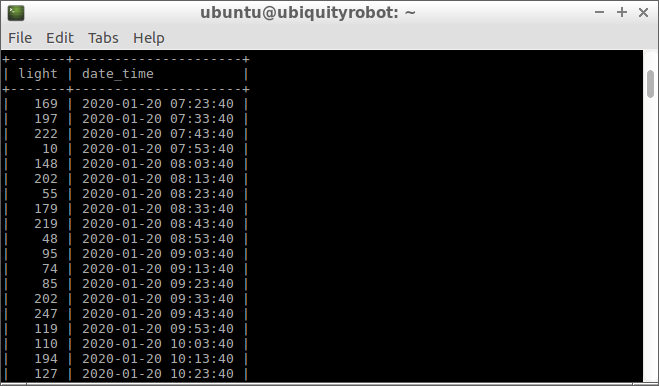
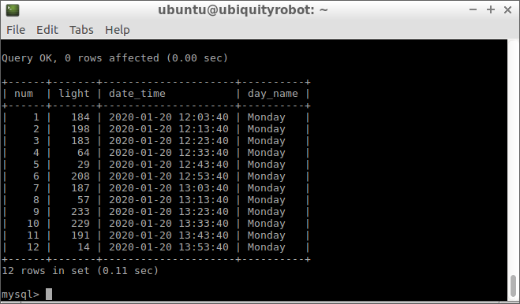
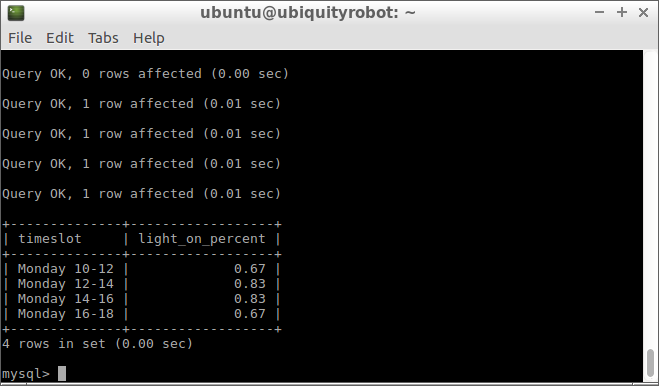
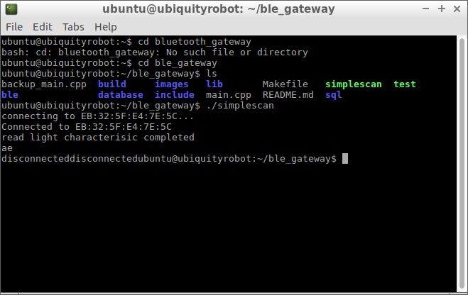

# BLE Gateway

A gateway that communicate with light sensor modules via BLE, collect light value and calculate the probability of light on.

This project belongs to my old master thesis. It was not finished because during lockdown I was not able to go to the lab. Therefore I have started a new master thesis: [robot scheduling](https://github.com/xuanjiao/Robots_task_scheduling)

# Requirements

[MySQL server](https://dev.mysql.com/downloads/mysql/)

# Installation 
```
git clone https://github.com/xuanjiao/ble_gateway.git
```
#   Usage:

## Create a sample light-timestamp table
1. Start mysql service, set it launch at reboot
```
sudo systemctl start mysql
sudo systemctl enable mysql
```
2. Start the mysql shell and enter it as root user
```
mysql -u root -p
```

3. disable the only_full_group_by setting
```
mysql> set global sql_mode='STRICT_TRANS_TABLES,NO_ZERO_IN_DATE,NO_ZERO_DATE,ERROR_FOR_DIVISION_BY_ZERO,NO_AUTO_CREATE_USER,NO_ENGINE_SUBSTITUTION';

set session sql_mode='STRICT_TRANS_TABLES,NO_ZERO_IN_DATE,NO_ZERO_DATE,ERROR_FOR_DIVISION_BY_ZERO,NO_AUTO_CREATE_USER,NO_ENGINE_SUBSTITUTION';

```
5. run sql script `createRawData.sql` to create a database with a table that stores some light value and timestamp. 

```
mysql> source ~/ble_gateway/sql/createRawData.sql;
```

6. compile main.cpp

```
gcc -o simplescan main.cpp -lbluetooth
./simplescan
```

result is:



6. write sql script `printLightValuesInTimeslot.sql` which find out light value for a specific timeslot. run

```
mysql> source ~/ble_gateway/sql/printLightValuesInTimeslot.sql;
```
result is:



7. write sql script `calculateLightOnPercent.sql`, which calculate light on possibility for timeslots.

```
mysql> source ~/ble_gateway/sql/calculateLightOnPercent.sql;
```
result is:




# Collect light values from sensors and create a light-timestamp table

implement ble gatt client class which can connect to ble gatt server(develop board), and read light value.

result is:


 
 TODO: Read BLE characteristic value from light sensor.
